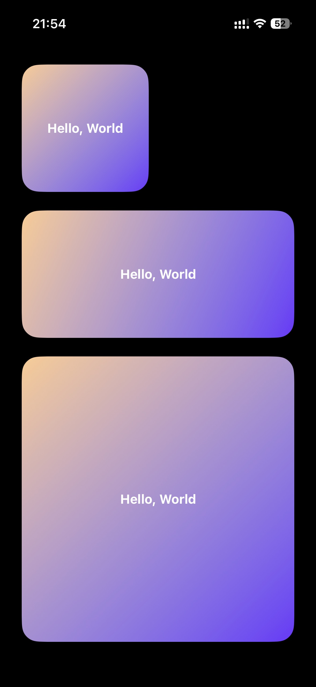

# Open-source Scriptable scripts for iOS Widgets

## 使用示例

```javascript
// 全局配置
const __GLOBAL_CONFIG__ = {
  name: 'World',
};
// 加载脚本
const url = 'https://cdn.jsdelivr.net/npm/@showlotus/open-scriptable@latest/dist/hello-world.js';
const code = await new Request(url).loadString();
// 执行脚本
eval(code);
```



## 组件列表

### 倒计时组件

```js
// 全局配置
const __GLOBAL_CONFIG__ = {
  days: {
    元旦: '2026-01-01',
    春节: '2026-02-17',
    清明节: '2026-04-04',
    劳动节: '2026-05-01',
    端午节: '2026-06-19',
    国庆节: '2026-10-01',
    中秋节: '2026-10-06',
  },
};

const url = 'https://cdn.jsdelivr.net/npm/@showlotus/open-scriptable@latest/dist/count-down.js';
const code = await new Request(url).loadString();
eval(code);
```

<div>
  
  
</div>

## 开发

```bash
# 安装依赖
pnpm install

# 启动开发服务器
pnpm dev
```

在 Scriptable 中加载 `http://192.168.5.6:3000/src/hello-world.ts` 脚本，即可看到效果。

```js
// 加载脚本
const url = 'http://192.168.5.6:3000/src/hello-world.ts';
const code = await new Request(url).loadString();
// 执行脚本
eval(code);
```
